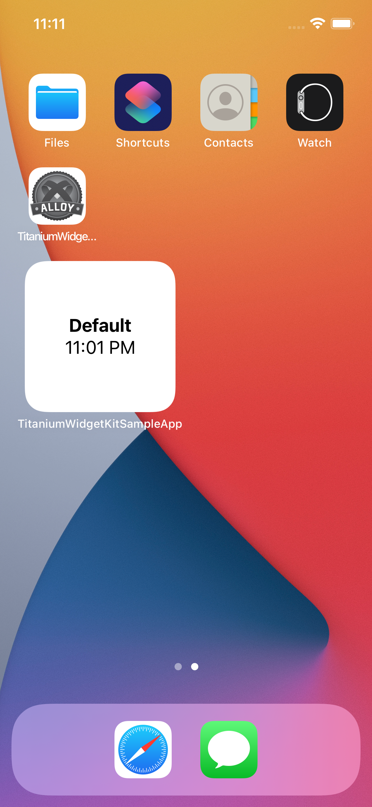

# Titanium iOS WidgetKit Sample App

A sample app demonstrating the WidgetKit capabilitites of Titanium in native iOS development.

 

## Before you start

Please read [this article](https://developer.apple.com/documentation/widgetkit/creating-a-widget-extension) to understand the general setup that is required to integrate widgets (e.g. app groups and new app IDs)

## Requirements

- [x] Access to a Apple Developer
- [x] Xcode 12+
- [x] iOS 14+
- [x] When deploying to device: New app groups, app IDs and provisioning profiles for the extension 

## Author

Hans Knöchel

## Copyright

2022-present by TiDev
